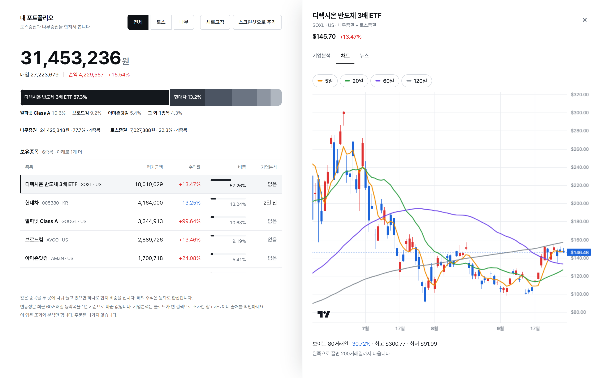
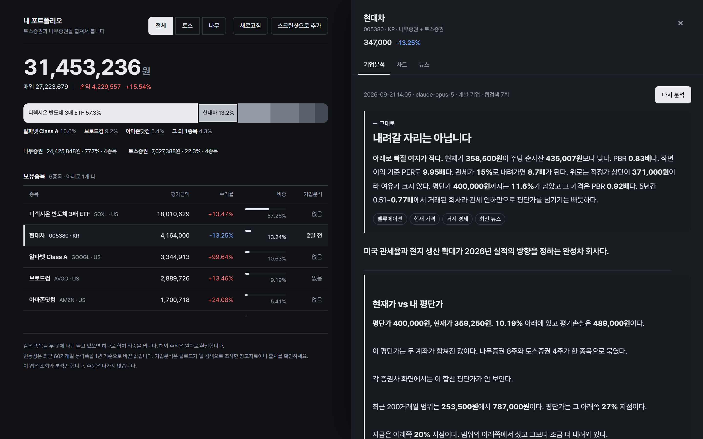
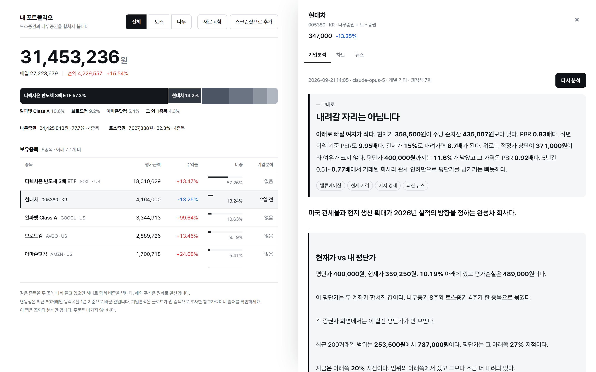
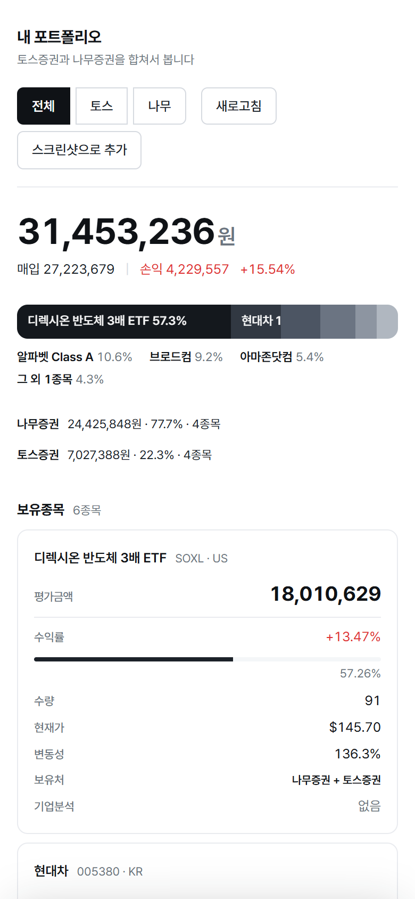

# 두 증권사를 합쳐서 보는 포트폴리오 분석기

[](https://github.com/younggeon03/stock-portfolio/actions/workflows/ci.yml)

증권사 앱은 자기 계좌만 보여줍니다. 같은 종목을 두 곳에 나눠 들고 있으면 **진짜 비중이 어디에도 안 보입니다.**

이 앱은 토스증권과 나무증권 계좌를 하나로 합쳐 실제 비중을 계산하고, 각 종목이 어떤 회사인지 정리합니다. 재무는 공시(DART·SEC EDGAR)에서 가져와 앱이 계산하고, 클로드는 전망과 의견만 웹에서 조사합니다.

## 이걸 만든 이유

SOXL을 양쪽에 나눠 들고 있었습니다. 실제로 본 숫자입니다.

| 보는 방식 | SOXL 비중 |
|---|---|
| 토스 앱에서만 | 2.98% |
| 나무 앱에서만 | 81.51% |
| **합치면** | **81.47%** |

토스 화면만 보고 "SOXL이 3%네, 더 사도 되겠다"고 판단할 뻔했습니다. 실제로는 이미 자산의 81%가 3배 레버리지 상품 한 종목에 몰려 있었습니다.

**한쪽만 보면 정반대로 움직입니다.** 이 앱의 존재 이유가 이 표 한 줄입니다.

## 화면

> 스크린샷의 보유 종목·수량·평단가는 **데모 데이터**입니다. 시세·차트·공시 재무는 실제 값입니다.



**비중 막대가 화면 위쪽 전체 폭을 차지하고, 가장 큰 종목은 이름이 막대 안에 적힙니다.** 이 앱이 발견하라고 만든 숫자이기 때문입니다. 막대에 마우스를 올리면 아래 표에서 같은 종목 줄이 함께 켜집니다. 반대도 됩니다.

보유종목은 다섯 줄만 보이고 나머지는 스크롤로 봅니다. 표가 화면을 다 먹지 않게 했습니다.

종목을 누르면 드로어가 열립니다. 데스크톱은 오른쪽에서 화면 절반을 차지하며, 휴대폰은 아래에서 올라옵니다. 그 안에서 기업분석, 차트, 뉴스를 탭으로 나눕니다. 드로어를 열어둔 채로 다른 종목을 눌러 갈아탈 수 있고, 모서리를 끌어 크기를 바꿀 수 있습니다.

차트는 일봉 캔들에 이동평균선 네 개입니다. 범례를 누르면 해당 선이 꺼집니다.

**색은 빨강과 파랑 두 개뿐이고 항상 등락만 뜻합니다.** 버튼이나 선택 표시에 색을 쓰면 숫자의 색이 묻힙니다. 강조는 검정으로 합니다. 비중 막대도 색이 아니라 명도로 순위를 보입니다.

**카드를 쓰지 않았습니다.** 둥근 모서리와 그림자를 두른 상자를 늘어놓는 건 어느 서비스에나 있는 기본값입니다. 흰 바탕에 선과 여백으로만 구분하고, 상자로 뜨는 건 실제로 떠 있는 것(드로어, 모달)뿐입니다.

**접근성은 자동으로 잽니다.** axe-core로 밝은 화면과 어두운 화면, 목록과 드로어, 모바일까지 네 조합을 검사해서 **위반 0**을 유지합니다. 사람 눈으로는 대비 4.37대 1과 4.5대 1을 구분할 수 없습니다.

### 어두운 화면



기기 설정을 따라갑니다. 빨강과 파랑은 어두운 바탕에서 탁해지므로 밝기를 따로 잡아 같은 뜻으로 읽히게 맞췄습니다.

### 기업분석 — 내 계좌를 아는 판정



**맨 위에 "지금 더 담아도 되는지" 판정이 뜹니다.** 종목에 대한 일반 의견이 아니라 **내 보유 상태에 대한 판정**입니다. 같은 SOXL이라도 답이 갈립니다.

| 누가 보느냐 | 판정 |
|---|---|
| 자산의 85%를 이미 넣은 사람 | 더 담지 마세요 |
| 안 들고 있는 사람 | 볼 만합니다 |

증권가 컨센서스는 누가 얼마나 들고 있는지 모르니 모두에게 같은 답을 줍니다. **공개 사이트가 구조적으로 못 하는 일입니다.**

판정 아래는 결론부터 읽히는 순서입니다. 한 줄 요약, 현재가 대 내 평단가, 감당 중인 위험, 그다음이 회사 조사입니다.

수량과 평단가, 수익률, 비중은 앱이 계산해서 넘깁니다. **재무도 공시 원본에서 가져옵니다.** 한국 종목은 DART, 미국 종목은 SEC EDGAR 에서 3개년과 최근 분기를 받고, PER·PBR·ROE 는 앱이 직접 나눕니다. 과거 결산일 주가로 "이 회사가 받아온 PER 범위" 까지 계산해 넣습니다. 클로드는 컨센서스·전망·산업 동향처럼 웹에서 찾아야만 아는 것만 조사합니다. ETF면 재무제표와 PER 섹션이 자동으로 "해당 없음"이 됩니다.

같은 PER 이라도 기준에 따라 두 배씩 달라집니다. 그래서 기준을 하나로 정했습니다. 최근 4분기 이익, 지배주주 몫, 보통주+우선주 주식수. 현대차는 이 기준을 적용하기 전과 후에 PER 이 7.89배와 11.47배로 달랐습니다. 이유는 [결정기록 010](docs/결정기록.md#010-재무는-공시에서-가져온다)에 있습니다.

지표는 **분기와 연도를 버튼으로 전환**해서 봅니다. PER이 13배라는 사실보다 지난 분기 12배에서 13배가 됐다는 게 더 많은 걸 말해줍니다.

### 휴대폰



좁은 화면에서는 표가 카드로 바뀝니다. 종목과 평가금액을 먼저 보여주고 수익률과 비중이 따라옵니다. 가로 스크롤이 없습니다.

## 뭐가 되나

| 기능 | 상태 |
|---|---|
| 두 증권사 보유종목 합산 + 실제 비중 | 동작 확인 |
| 같은 종목 합치기, 해외주식 원화 환산 | 동작 확인 |
| 일봉 캔들차트, 이동평균선 네 개 | 동작 확인 |
| 종목별 연환산 변동성 | 동작 확인 |
| 종목 뉴스 목록 (구글 RSS, 무료) | 동작 확인 |
| 공시 재무 + PER·PBR·과거 배수 (DART·SEC EDGAR, 무료) | 동작 확인 |
| 기관 투자자 포트폴리오 수집 (국민연금·버크셔 등 10곳, SEC 13F, 매일 아침) | 수집·조회 API 동작 확인, 화면은 다음 |
| 뉴스 인사이트 (버튼, 하루 한 번) | 파이프라인 검증됨, 크레딧 대기 |
| 지금 더 담아도 되는지 판정 | 파이프라인 검증됨, 크레딧 대기 |
| 스크린샷으로 보유종목 등록 | 파이프라인 검증됨, 크레딧 대기 |
| 기업분석 (클로드 + 웹검색) | 파이프라인 검증됨, 크레딧 대기 |

**솔직하게 적어두는 것 두 가지입니다.**

앤트로픽 계정에 크레딧이 없습니다. API 키 인증과 응답 처리까지는 전부 검증했고 잔액만 없습니다. 충전하면 버튼 한 번으로 동작합니다. 화면에 보이는 기업분석은 같은 프롬프트로 클로드 코드 CLI 에서 조사해 넣은 것이고, 화면 메타에 모델이 `클로드 코드 CLI` 로 표시됩니다. 공시 재무를 붙이기 전(2026-09-21)에 만든 것이라 재무는 웹 조사 기준입니다.

토스가 허용 IP 목록으로 요청을 거릅니다. 학교 망이라 IP가 자주 바뀌어서 그때마다 다시 등록해야 합니다. 403이 뜨면 앱이 현재 공인 IP를 직접 알려주도록 만들어 뒀습니다.

## 빠르게 실행하기

```bash
git clone https://github.com/younggeon03/stock-portfolio.git
cd stock-portfolio
cp .env.example .env         # 키를 채웁니다
docker compose up -d --build # 앱 + MySQL
```

브라우저에서 <http://localhost:8080> 을 엽니다. 도커 없이 jar 로 돌리는 법과 키 발급 순서는 [운영](docs/운영.md) 에 있습니다.

## 만든 것

| | |
|---|---|
| 백엔드 | Spring Boot 3.3.5, Java 21, JPA, MySQL |
| 프론트 | HTML + CSS + 바닐라 JS (빌드 도구 없음) |
| 차트 | TradingView Lightweight Charts |
| 분석 | Anthropic Java SDK, 웹검색 도구 |
| 외부 API | 토스증권 Open API, 나무증권 NAMUH PLUG, DART OpenAPI, SEC EDGAR |
| 테스트 | JUnit 5, AssertJ, 104개 |
| 빌드·배포 | Docker, GitHub Actions (PR 마다 테스트·커버리지·이미지 빌드, `main` 병합 시 ghcr.io 에 이미지 게시) |
| 운영 | Actuator 헬스체크·Prometheus 지표, Flyway 마이그레이션, 토큰 AES-GCM 암호화 |

프론트엔드에 프레임워크를 쓰지 않았습니다. 화면이 표 하나와 드로어 하나뿐이라 리액트를 얹으면 빌드 설정이 앱보다 커집니다. 외부 의존성은 차트 라이브러리 하나가 전부이고, 그마저 안 불러와지면 차트만 안 뜨고 나머지는 그대로 동작합니다.

## 설계에서 눈여겨볼 곳

**증권사를 갈아끼울 수 있게 만들었습니다.** `BrokerageClient` 인터페이스를 구현하고 `@Component`만 붙이면 비중·분석·차트 코드를 하나도 안 고치고 증권사가 늘어납니다. "직접 입력"도 이 인터페이스를 구현해서, 나머지 코드는 그게 진짜 증권사인지 손으로 넣은 값인지 모릅니다.

**환각을 막으려고 산수를 모델에게 안 맡깁니다.** 수량·평단가·수익률·비중, 그리고 공시 재무와 PER·PBR 은 앱이 계산해서 "이건 사실이니 다시 계산하지 마라"고 프롬프트에 넣습니다. 클로드는 웹에서 찾아야만 아는 것만 조사합니다. ETF 여부도 추측이 아니라 토스가 준 `securityType`으로 가릅니다.

**돈이 나가는 지점을 버튼 뒤로 몰았습니다.** 화면을 훑기만 해도 분석이 돌면 비용이 샙니다. 기업분석과 뉴스 인사이트는 버튼을 눌러야만 실행됩니다. 한 번 돌리면 저장돼서 다시 볼 때는 0원입니다.

## 절대 하지 않는 것

- **주문을 내지 않습니다.** 하지 않기로 한 게 아니라, `BrokerageClient` 인터페이스에 주문 메서드를 정의하지 않았습니다. 실수로도 호출할 수 없습니다.
- **키를 커밋하지 않습니다.** `.env`는 `.gitignore`에 있고 브라우저로 내려가지 않습니다.
- **목표주가와 수량을 말하지 않습니다.** 판정은 방향까지입니다. "12만원까지 간다", "3주 파세요" 는 하지 않습니다.
- **근거 없는 판정을 띄우지 않습니다.** 판정에는 항상 내 비중과 평단가가 들어간 이유가 붙습니다. 근거가 모자라면 판단을 보류합니다.

## 문서

다섯 개입니다. 처음이라면 이 README → [아키텍처](docs/아키텍처.md) 1~4장 → [결정기록 003](docs/결정기록.md#003-숫자는-앱이-계산하고-조사만-llm에게-맡긴다) 순서면 충분합니다.

| 문서 | 담는 것 | 언제 보나 | 언제 바뀌나 |
|---|---|---|---|
| [아키텍처](docs/아키텍처.md) | 서버 구성, 계층, 요청 흐름, 바깥 연동, DB, API 계약 | 코드를 고치기 전 | 구조가 바뀌면 고침 |
| [운영](docs/운영.md) | 세팅, 실행(도커·jar), 테스트·CI, 장애 대응 | 처음 띄울 때, 에러가 났을 때 | 절차나 해결법이 바뀌면 |
| [로드맵](docs/로드맵.md) | 실무 경험을 쌓는 단계별 계획과 남은 일 | 다음에 뭘 할지 | 끝나면 지움 |
| [결정기록](docs/결정기록.md) | 되돌리기 어려운 판단과 그 대가 | "왜 이렇게 했지" 싶을 때 | 안 고침. 새 기록을 덧붙임 |
| [개발일지](docs/개발일지.md) | 방향이 바뀐 지점의 회고 | 어떤 순서로 만들었는지 | 덧붙이기만 |

주소 목록은 손으로 적지 않습니다. 앱을 띄우고 <http://localhost:8080/swagger-ui.html> 을 여세요. 코드에서 자동 생성됩니다.

새 내용을 쓸 때 어디에 넣을지 헷갈리면 **"이게 언제 바뀌나"** 를 먼저 물어보세요. 같은 내용을 두 곳에 쓰지 말고 링크를 겁니다. 중복된 문서는 반드시 어긋납니다.

개인 프로젝트입니다. 투자 판단의 근거로 쓰라고 만든 것이 아닙니다.
